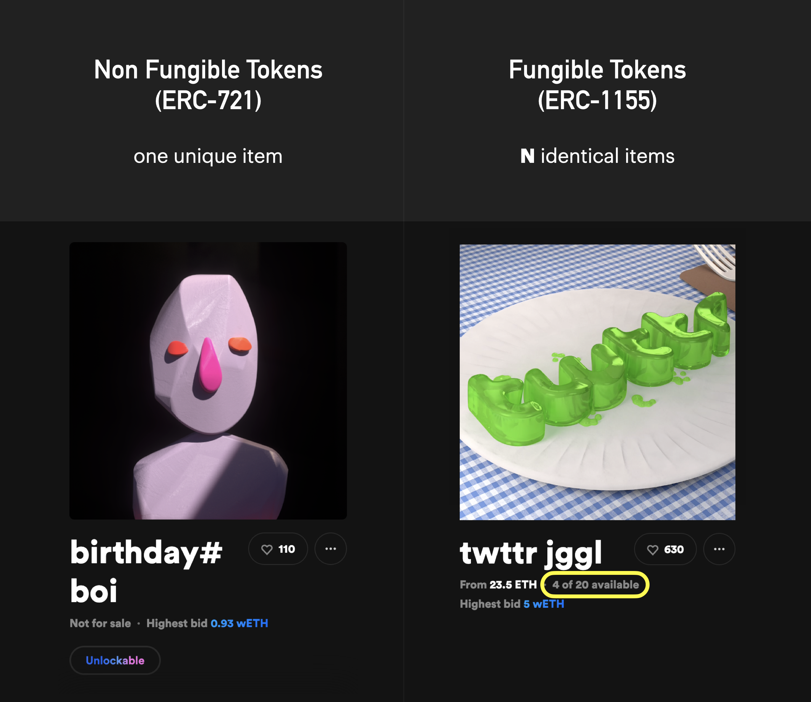
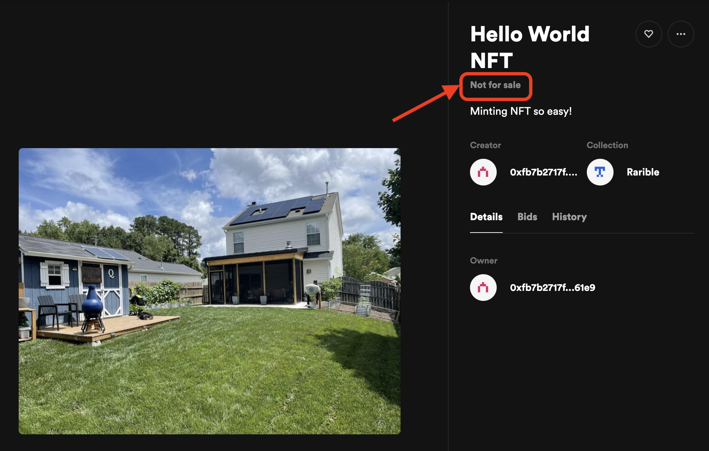
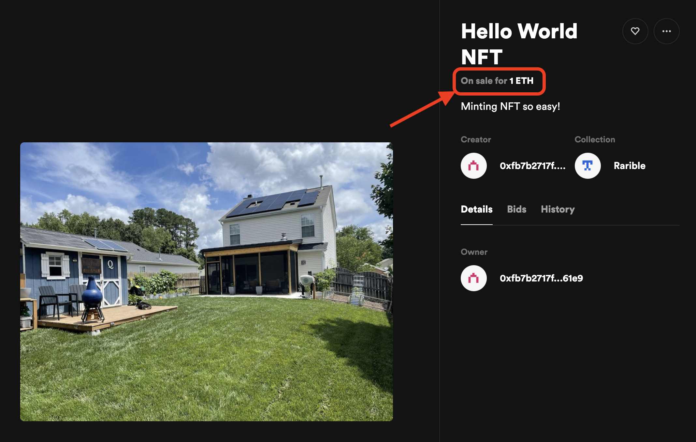
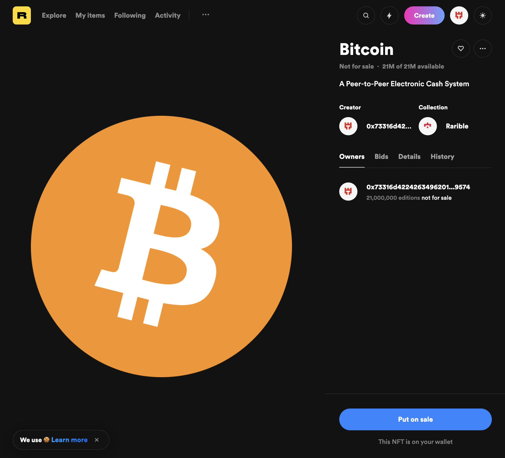
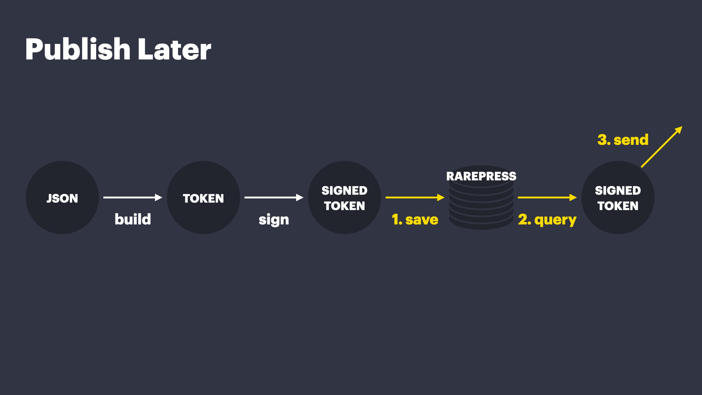
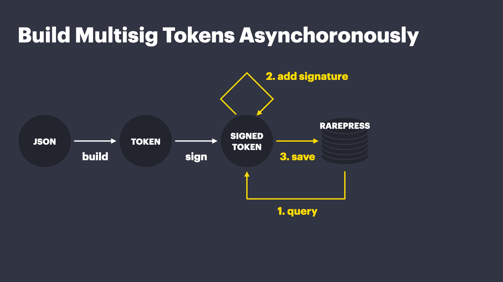

<header>
  <a href="https://rarepress.org">Home</a>
  <a href="https://twitter.com/skogard">Twitter</a>
  <a href="https://github.com/rarepress">GitHub</a>
  <a href="https://discord.gg/BZtp5F6QQM">Discord</a>
</header>

> Looking for the main documentation?: https://guide.rarepress.org
>
> Looking for API reference?: https://api.rarepress.org

# Examples

Because Rarepress has the database and file system built in, you can do pretty much anything you can imagine.

This section explains some scenarios you may come across often.


# Tutorial

## Intro

Before we begin, let's first start by understanding the difference between **Non Fungible Tokens (NFT)** and **Fungible Tokens**.



1. **Non Fungible Tokens (NFT):** It's ONE unique item. (In above example, there is ever only one unique "birtday#boi" NFT). It's powered by Ethereum's [ERC-721](https://eips.ethereum.org/EIPS/eip-721) standard.
2. **Fungible Tokens:** It's a bundle of **N** identical items (In above example, there are 20 identical tokens in the 'twttr jggl' universe, of which 4 are on sale). Essentially, you can use these tokens like ERC20 tokens. It's powered by Ethereum's [ERC-1155](https://eips.ethereum.org/EIPS/eip-1155) standard.

> **NOTE**
>
> Technically ERC-1155 Tokens were designed as an extension of ERC-721 to facilitate [BOTH Non fungible and fungible tokens](https://eips.ethereum.org/EIPS/eip-1155), but in this tutorial we will just use ERC721 for non fungible and ERC1155 for fungible, for the sake of easy explanation.


## Prerequisites

This tutorial assumes that you have already installed [Metmask wallet](https://metamask.io/). If you haven't, go install it first.


That's about all you need before getting started. Everything will happen in the frontend so You only need a web browser.

Now we are ready. Let's get right to some working examples.

> **NOTE**
>
> The examples below are using the rinkeby testnet https://rinkeby.rarenet.app/v1 but if you want to put it on mainnet, simply switch out the URL to https://eth.rarenet.app/v1


## NFT (ERC721)

### Mint

Let's try minting a unique NFT (ERC721).

We will build the most minimal web app possible, it won't even have a UI. It simply has a "mint" function and the mint function is automatically called when the page loads.

Copy and paste the following code and save it as `index.html`.

```html
<html>
<body>
<pre id='token'></pre>
<pre id='receipt'></pre>
<script src="https://unpkg.com/rareterm@0.0.9"></script>
<script>
const mint = async () => {

  // 1. Initialize a rarepress object from Rareterm
  const rarepress = new Rareterm();
  // 2. Connect to a rinkeby rarenet node
  await rarepress.init({ host: "https://rinkeby.rarenet.app/v1" })

  // 3. Import a web image to rarepress file system
  let cid = await rarepress.fs.add("https://i.imgur.com/7VtdUHN.jpeg")

  // 4. Create and save a token on rarepress
  let token = await rarepress.token.create({
    type: "ERC721",
    metadata: {
      name: "Hello World NFT",
      description: "Minting NFT so easy!",
      image: "/ipfs/" + cid
    }
  })

  // 5. Publish the image on public IPFS
  await rarepress.fs.push(cid)
  // 6. Publish the metadata on public IPFS
  await rarepress.fs.push(token.tokenURI)

  // 7. Publish the token to the marketplace
  let receipt = await rarepress.token.send(token)

  document.querySelector("#token").innerHTML = "token object\n\n" + JSON.stringify(token, null, 2)
  document.querySelector("#receipt").innerHTML = "token publish receipt\n\n" + JSON.stringify(receipt, null, 2)
}
mint()
</script>
</body>
</html>
```

Start a local web server using something like [http-server](https://github.com/http-party/http-server) or whatever you like. Load the page in your browser.

Here's what's going on in the `mint()` function:

1. Initialize rarepress (`new Rareterm()` to create a `rarepress` object, and then `rarepress.init()`)
2. Add a file at https://i.imgur.com/7VtdUHN.jpeg to IPFS (`await rarepress.fs.add("https://i.imgur.com/7VtdUHN.jpeg")`)
3. Create and save an NFT to rarepress by specifying name, description and the image we just added to IPFS (`await rarepress.token.create()`)
4. publish the image file to IPFS using `rarepress.fs.push(cid)` (Before calling this function, the files are privately stored on rarepress only)
5. publish the token metadata file to IPFS using `rarepress.fs.push(token.tokenURI)`. The `token.tokenURI` will contain the IPFS URI of the metadata, so this command publishes the metadata to the public IPFS network.
6. Now that all the files are published on the public IPFS network, we can publish the token itself. We do that by calling `rarepress.token.send(token)`. The `send()` can take a second argument that sends to any URL, but if you don't specify a URL, by default it's sent to rarible.com's marketplace endpoints.
7. Print the returned token inside a `pre` tag to inspect what the token looks like.

It should print something like:

```json
token object

{
  "@type": "ERC721",
  "tokenId": "52103307166765014994970427877263908096137622415890461916725030524604237615235",
  "uri": "/ipfs/bafkreia3wxburesb7qmmuirovyhekn4mu23qsjxfwcj3p4mrqaumva7swa",
  "tokenURI": "/ipfs/bafkreia3wxburesb7qmmuirovyhekn4mu23qsjxfwcj3p4mrqaumva7swa",
  "contract": "0x6ede7f3c26975aad32a475e1021d8f6f39c89d82",
  "creators": [
    {
      "account": "0x73316d4224263496201c3420b36cdda9c0249574",
      "value": 10000
    }
  ],
  "royalties": [],
  "signatures": [
    "0xe5106cbf49fdd90fa4f13a5671fd9b228cd0ba190ded6c9ec6c1c34d2d89f58d1e43446d92e4d1c2898f4a0a061f6d7d18c68b544b2e891dc9ae9fd53a1b25e81c"
  ]
}


token publish receipt

{
  "id": "0x6ede7f3c26975aad32a475e1021d8f6f39c89d82:52103307166765014994970427877263908096137622415890461916725030524604237615235",
  "contract": "0x6ede7f3c26975aad32a475e1021d8f6f39c89d82",
  "tokenId": "52103307166765014994970427877263908096137622415890461916725030524604237615235",
  "creators": [
    {
      "account": "0x73316d4224263496201c3420b36cdda9c0249574",
      "value": 10000
    }
  ],
  "supply": "1",
  "lazySupply": "1",
  "owners": [
    "0x73316d4224263496201c3420b36cdda9c0249574"
  ],
  "royalties": [],
  "date": "2021-09-02T21:04:01Z",
  "pending": [],
  "deleted": false
}
```

- token object: this is the actual token that can be passed around
- token publish receipt: this is the HTTP response you get when you publish above token object to a marketplace (in this case Rarible.com)

Let's take a look at the `token object`, which looks like this:

```json
{
  "@type": "ERC721",
  "tokenId": "52103307166765014994970427877263908096137622415890461916725030524604237615235",
  "uri": "/ipfs/bafkreia3wxburesb7qmmuirovyhekn4mu23qsjxfwcj3p4mrqaumva7swa",
  "tokenURI": "/ipfs/bafkreia3wxburesb7qmmuirovyhekn4mu23qsjxfwcj3p4mrqaumva7swa",
  "contract": "0x6ede7f3c26975aad32a475e1021d8f6f39c89d82",
  "creators": [
    {
      "account": "0x73316d4224263496201c3420b36cdda9c0249574",
      "value": 10000
    }
  ],
  "royalties": [],
  "signatures": [
    "0xe5106cbf49fdd90fa4f13a5671fd9b228cd0ba190ded6c9ec6c1c34d2d89f58d1e43446d92e4d1c2898f4a0a061f6d7d18c68b544b2e891dc9ae9fd53a1b25e81c"
  ]
}
```

Here's what each attribute means:

1. `contract`: The contract address for the NFT (The Rarible NFT contract address)
2. `tokenId`: The tokenId for the minted NFT
3. `creators`: If you do not explicitly specify `creators`, it will automatically set it as the person who signed the message through the wallet. In this case, the account was `0xfb7b2717f7a2a30b42e21cef03dd0fc76ef761e9`. The `value` of 10000 means this is the sole creator (10000 is 100%).
4. `supply`: The supply is 1 because it's a unique NFT with only one in existence.
5. `owners`: The initial creators automatically become the owners in this case.
6. `royalties`: On-chain royalties for the NFT. In this case not specified so it's empty.

And that's literally it! Once you're done, go to Rarible's homepage and check that your minted NFT is there in the `created` tab under `my items`: https://rinkeby.rarible.com/items?tab=created



### Sell

Now that we know how to mint an NFT, let's learn how to sell it!

In the following code we will first mint an NFT, and then put it on sale by using the `rarepress.trade` API.

```html
<html>
<body>
<pre id='token'></pre>
<pre id='tokenRecipt'></pre>
<pre id='trade'></pre>
<pre id='tradeRecipt'></pre>
<script src="https://unpkg.com/rareterm@0.0.9"></script>
<script>
const rarepress = new Rareterm();
const mint = async () => {
  // add an image file to FS
  let cid = await rarepress.fs.add("https://i.imgur.com/7VtdUHN.jpeg")
  // create and save a token to rarepress
  let token = await rarepress.token.create({
    type: "ERC721",
    metadata: {
      name: "Hello World NFT",
      description: "Minting NFT so easy!",
      image: "/ipfs/" + cid
    }
  })
  // publish the image to IPFS
  await rarepress.fs.push(cid)
  // publish the metadata to IPFS
  await rarepress.fs.push(token.tokenURI)
  // publish the token itself to Rarible marketplace
  let receipt = await rarepress.token.send(token)
  return {
    token,
    receipt
  }
}
const sell = async (tokenId) => {
  let trade = await rarepress.trade.create({
    what: {
      type: "ERC721",
      id: tokenId,
    },
    with: {
      type: "ETH",
      value: 10**18
    }
  })
  let receipt = await rarepress.trade.send(trade)
  return {
    trade,
    receipt
  }
};
const mintAndSell = async () => {
  await rarepress.init({ host: "https://rinkeby.rarenet.app/v1" })
  let tokenItem = await mint()
  document.querySelector("#token").innerHTML = "token object\n\n" + JSON.stringify(tokenItem.token, null, 2)
  document.querySelector("#tokenRecipt").innerHTML = "token receipt\n\n" + JSON.stringify(tokenItem.receipt, null, 2)
  let tradeItem = await sell(tokenItem.token.tokenId)
  document.querySelector("#trade").innerHTML = "trade object\n\n" + JSON.stringify(tradeItem.trade, null, 2)
  document.querySelector("#tradeRecipt").innerHTML = "trade receipt\n\n" + JSON.stringify(tradeItem.receipt, null, 2)
}
mintAndSell()
</script>
</body>
</html>
```

So what is going on here?

1. The `mint` function is not much different from the previous "mint" example (except that we've extracted out the init function)
2. We now have a `sell` function, which takes the `tokenId` of the minted token and creates a trade position (sell order).
3. Notice the `rarepress.trade.create()` takes an object with two attributes `what` and `with`
  - `what` describes which of your tokens you're trying to trade
    - `type` is `"ERC721"` because it's an NFT (ERC721).
    - `id` is the tokenId that was passed in
  - `with` describes which other asset you'd like to trade your token with
    - `type` is `"ETH"` so you want to trade it for ETH (Ethereum)
    - `value` is `10**18` (10 to the 18th power). Note that it doesn't mean you want to sell it at `10**18` ETH, the unit is in wei, the smallest unit of Ethereum. therefore it's saying "I want to sell at 10 to the 18th power wei (which is 1ETH)".

When you run it, you will be asked to sign twice. First for minting, and then for creating the sell order.

When you sign the sell order and submit using the `create()` method, it will print something like the following:

```json
token object

{
  "@type": "ERC721",
  "tokenId": "52103307166765014994970427877263908096137622415890461916637201629729688871060",
  "uri": "/ipfs/bafkreia3wxburesb7qmmuirovyhekn4mu23qsjxfwcj3p4mrqaumva7swa",
  "tokenURI": "/ipfs/bafkreia3wxburesb7qmmuirovyhekn4mu23qsjxfwcj3p4mrqaumva7swa",
  "contract": "0x6ede7f3c26975aad32a475e1021d8f6f39c89d82",
  "creators": [
    {
      "account": "0x73316d4224263496201c3420b36cdda9c0249574",
      "value": 10000
    }
  ],
  "royalties": [],
  "signatures": [
    "0x26d10a521c2d01bf8f32a3cb413cb46a1ea15cb56aba9e6d7c7023562c041b5c45e30af6de3de2ccb1c46e144d7cdb45a50d675ba9c25d45bc73d4abaa55f28c1b"
  ]
}


token receipt

{
  "id": "0x6ede7f3c26975aad32a475e1021d8f6f39c89d82:52103307166765014994970427877263908096137622415890461916637201629729688871060",
  "contract": "0x6ede7f3c26975aad32a475e1021d8f6f39c89d82",
  "tokenId": "52103307166765014994970427877263908096137622415890461916637201629729688871060",
  "creators": [
    {
      "account": "0x73316d4224263496201c3420b36cdda9c0249574",
      "value": 10000
    }
  ],
  "supply": "1",
  "lazySupply": "1",
  "owners": [
    "0x73316d4224263496201c3420b36cdda9c0249574"
  ],
  "royalties": [],
  "date": "2021-09-02T20:56:18Z",
  "pending": [],
  "deleted": false
}


trade object

{
  "type": "RARIBLE_V2",
  "make": {
    "assetType": {
      "assetClass": "ERC721",
      "tokenId": "52103307166765014994970427877263908096137622415890461916637201629729688871060",
      "contract": "0x6ede7f3c26975aad32a475e1021d8f6f39c89d82"
    },
    "value": "1"
  },
  "take": {
    "assetType": {
      "assetClass": "ETH"
    },
    "value": "1000000000000000000"
  },
  "data": {
    "dataType": "RARIBLE_V2_DATA_V1",
    "payouts": [],
    "originFees": []
  },
  "salt": "163061617874994499",
  "maker": "0x73316d4224263496201c3420b36cdda9c0249574",
  "signature": "0x4e77d8c7b872dcd39167c3bda45727cb688dbfeb0c50f747a200d25951b8eda14506767f4bb9cfe16f590b26b64cbf915235b4afd88669adfcde461ed432d7951b"
}


trade receipt

{
  "type": "RARIBLE_V2",
  "maker": "0x73316d4224263496201c3420b36cdda9c0249574",
  "make": {
    "assetType": {
      "assetClass": "ERC721_LAZY",
      "contract": "0x6ede7f3c26975aad32a475e1021d8f6f39c89d82",
      "tokenId": "52103307166765014994970427877263908096137622415890461916637201629729688871060",
      "uri": "/ipfs/bafkreia3wxburesb7qmmuirovyhekn4mu23qsjxfwcj3p4mrqaumva7swa",
      "creators": [
        {
          "account": "0x73316d4224263496201c3420b36cdda9c0249574",
          "value": 10000
        }
      ],
      "royalties": [],
      "signatures": [
        "0x26d10a521c2d01bf8f32a3cb413cb46a1ea15cb56aba9e6d7c7023562c041b5c45e30af6de3de2ccb1c46e144d7cdb45a50d675ba9c25d45bc73d4abaa55f28c1b"
      ]
    },
    "value": "1"
  },
  "take": {
    "assetType": {
      "assetClass": "ETH"
    },
    "value": "1000000000000000000"
  },
  "fill": "0",
  "makeStock": "1",
  "cancelled": false,
  "salt": "0x00000000000000000000000000000000000000000000000002434fad71f08543",
  "signature": "0x4e77d8c7b872dcd39167c3bda45727cb688dbfeb0c50f747a200d25951b8eda14506767f4bb9cfe16f590b26b64cbf915235b4afd88669adfcde461ed432d7951b",
  "createdAt": "2021-09-02T20:56:30Z",
  "lastUpdateAt": "2021-09-02T20:56:30Z",
  "pending": [],
  "hash": "0xb829f199f92162b1d8bc5ea2edecc47389d567aeac79116462dc4fa6c39063a3",
  "makeBalance": "0",
  "makePriceUsd": 3776.6242843034156,
  "data": {
    "dataType": "RARIBLE_V2_DATA_V1",
    "payouts": [],
    "originFees": []
  }
}
```

There are 4 items here:

- token object: prints the actual token object
- token receipt: prints the HTTP response you get when you publish the token to a marketplace (in this case from Rarible.com)
- trade object: prints the actual trade object
- trade receipt: prints the HTTP response you get when you publish the trade to a markketplace (in this case from Rarible.com)

Let's take a look at the "trade object", since we have discussed the token object and receipts from the previous section. The trade object looks like the following:

```json
trade object

{
  "type": "RARIBLE_V2",
  "make": {
    "assetType": {
      "assetClass": "ERC721",
      "tokenId": "52103307166765014994970427877263908096137622415890461916637201629729688871060",
      "contract": "0x6ede7f3c26975aad32a475e1021d8f6f39c89d82"
    },
    "value": "1"
  },
  "take": {
    "assetType": {
      "assetClass": "ETH"
    },
    "value": "1000000000000000000"
  },
  "data": {
    "dataType": "RARIBLE_V2_DATA_V1",
    "payouts": [],
    "originFees": []
  },
  "salt": "163061617874994499",
  "maker": "0x73316d4224263496201c3420b36cdda9c0249574",
  "signature": "0x4e77d8c7b872dcd39167c3bda45727cb688dbfeb0c50f747a200d25951b8eda14506767f4bb9cfe16f590b26b64cbf915235b4afd88669adfcde461ed432d7951b"
}
```

This is the final order that was submitted to Rarible protocol. Here's what some of the attributes mean:

1. `maker`: The person who signed the order (You)
2. `make`: The "maker" condition. This condition was described through the `what` attribute in the Rarepress code above. Basically this describes what asset you're trying to trade.
3. `take`: The "taker" condition. This condition was described through the `with` attribute in the Rarepress code above. Basically this describes what asset you're trying to exchange your asset with. In this case it's "ETH" with the value of "1000000000000000000"
4. `signature`: This is the signature of the entire order to prove authenticity.

There are other attributes as well but they're not important at this stage. You can learn more as you start playing with Rarepress.

And that's all there is!

Now if you go to https://rinkeby.rarible.com/items?tab=created you will find your minted token, but this time it's not only listed there but also put on sale for **1 ETH**.



Note that if you only minted the item and didn't create a sell order, it would just say "Not for sale", like this:


And that's it! Simple! No solidity. No web3. This is literally all you ever need to tokenize and trade ANYTHING on Ethereum.

## Fungible Tokens (ERC1155)

Now let's try ERC1155, creating a bundle of N identical items. To put it simply, you can think of these almost like ERC20 tokens. 

### Mint

With fungible tokens, you are creating N items with the same unique property.

> For example, Bitcoin is a "fungible token" because it's a token system with 21,000,000 items of same unique property.

With Rarepress, minting fungible tokens is as simple as adding one line to the ER721 code: You just need to add a `supply` attribute (in this case 21,000,000).

```html
<html>
<body>
<pre id='token'></pre>
<pre id='tokenReceipt'></pre>
<script src="https://unpkg.com/rareterm@0.0.9"></script>
<script>
const mint = async () => {
  // 1. Initialize
  const rarepress = new Rareterm();
  await rarepress.init({ host: "https://rinkeby.rarenet.app/v1" })
  // 2. Add files to IPFS
  let cid = await rarepress.fs.add("https://upload.wikimedia.org/wikipedia/commons/thumb/9/9a/BTC_Logo.svg/1200px-BTC_Logo.svg.png")
  // 3. Mint ERC1155 made up of 21000000 items
  let token = await rarepress.token.create({
    type: "ERC1155",
    metadata: {
      name: "Bitcoin",
      description: "A Peer-to-Peer Electronic Cash System",
      image: "/ipfs/" + cid
    },
    supply: 21000000
  })
  // 4. publish image to IPFS
  await rarepress.fs.push(cid)
  // 5. publish metadata to IPFS
  await rarepress.fs.push(token.tokenURI)
  // 6. publish the token to Rarible marketplace
  let receipt = await rarepress.token.send(token)
  document.querySelector("#token").innerHTML = JSON.stringify(token, null, 2)
  document.querySelector("#tokenReceipt").innerHTML = JSON.stringify(receipt, null, 2)
}
mint()
</script>
</body>
</html>
```

We won't go through the details this time because it's pretty much the same. The only difference are:

- `supply`: this is a fungible token so we need to set the supply. In this case it's set to 21000000
- `type`: If you don't specify the `type` attribute, it's automatically set as `"ERC721"`. But in this case we are trying to mint an ERC1155 token, so we specify the `type: "ERC1155"` attribute.

And that's about it!

If you understand the NFT tutorial, you'll understand how to mint fungible tokens too.

And just like NFT, this is literally all there is to minting fungible tokens! You can find your token at https://rarible.com/items?tab=created

It should look something like this (note the "21M of 21M available" part):



### Sell

Let's put our Bitcoin fungible tokens up for sale. 


```html
<html>
<body>
<pre id='token'></pre>
<pre id='trade'></pre>
<script src="https://unpkg.com/rareterm@0.0.9"></script>
<script>
const rarepress = new Rareterm();
const mint = async () => {

  // 1. Add files to IPFS
  let cid = await rarepress.fs.add("https://i.imgur.com/7VtdUHN.jpeg")
  //let cid = await rarepress.fs.add("https://upload.wikimedia.org/wikipedia/commons/thumb/9/9a/BTC_Logo.svg/1200px-BTC_Logo.svg.png")

  // 2. Create and save the ERC1155 token made up of 21000000 items, to Rarepress
  let token = await rarepress.token.create({
    type: "ERC1155",
    metadata: {
      name: "Bitcoin",
      description: "A Peer-to-Peer Electronic Cash System",
      image: "/ipfs/" + cid,
    },
    supply: 21000000
  })

  // 3. publish image to IPFS
  await rarepress.fs.push(cid)

  // 4. publish metadata to IPFS
  await rarepress.fs.push(token.tokenURI)

  // 5. publish the token to Rarible marketplace
  let receipt = await rarepress.token.send(token)

  return {
    token,
    receipt
  }
}
const sell = async (tokenId) => {
  let trade = await rarepress.trade.create({
    what: {
      type: "ERC1155",
      id: tokenId,
      value: 21000000
    },
    with: {
      type: "ETH",
      value: 10**18
    }
  })
  let receipt = await rarepress.trade.send(trade)
  return {
    trade,
    receipt
  }
};
const mintAndSell = async () => {
  await rarepress.init({ host: "https://rinkeby.rarenet.app/v1" })
  let tokenItem = await mint()
  document.querySelector("#token").innerHTML = JSON.stringify(tokenItem, null, 2)
  let tradeItem = await sell(tokenItem.token.tokenId)
  document.querySelector("#trade").innerHTML = JSON.stringify(tradeItem, null, 2)
}
mintAndSell()
</script>
</body>
</html>
```

It's not so much different from our NFT example. The difference is:

1. in the `rarepress.token.create()`,
    - we now have an additional attribute named `supply`, whose value is 21 million.
    - Also the `type` is set to `"ERC1155"`
2. in `rarepress.trade.create()`,
    - the `what.type` is "ERC1155" (Fungible token) instead of "ERC721"
    - the `what.value` is 21000000, because we are going to put all of the total supply (21 million) on sale.

Basically, we are creating a sell order that says "I am going to sell all of the 21 million Bitcoin tokens at 1 ETH each".

This is pretty much all you need to know to tokenize anything, but Rarepress has other advanced features. Check out the following "Recipes" section for some more examples.

---

# Importing and Exporting Wallet

There can be 2 scenarios:

1. **import:** You want to import your external wallet seed into rarepress
2. **export:** You want to export your rarepress wallet seed to external wallets

To import or export a wallet seed, we need to do it using the underlying wallet that powers rarepress.

`rarepress` and `rareterm.node` use a wallet library called [mushie](https://www.npmjs.com/package/mushie) (`rareterm` doesn't need to use this because it's for the browser and automatically uses Metamask), which is designed to allow flexible account switching, bulk signatures, and programmability.

## Import

To import a seed, you must first make sure your rarepress wallet is empty (otherwise it will overwrite the existing seed).

#### 1. Back up existing seed

If you already have a rarepress wallet, first back up your seed by following the instructions in the [next section](#export).

#### 2. Delete the wallet

Once you have backed up, remove the wallet file:

```
rm ~/.mushie
```

#### 3. Import a seed

Now we are ready to import. Let's import a seed using the `mushie` library:

```
npx mushie import
```

It will ask you to enter the seed phrase, and then an encryption password.

## Export

There are two things you can export from the wallet:

1. **The seed phrase:** You can export the seed phrase.
2. **A single private key:** You can also selectively export a single private key derived from the seed phrase by supplying a derivation path.

#### 1. Export the seed

To export the seed phrase, run the following:

```
npx mushie export
```

It will ask you if you want to export seed or a privatekey.

**Select `"export the seed"`.**

Then it will ask for the decryption password. Enter it and it will print the decrypted seed phrase.

#### 2. Export a single private key

You can export a single private key derived from the seed by supplying its [BIP44 derivation path](https://github.com/bitcoin/bips/blob/master/bip-0044.mediawiki).

Call

```
npx mushie export
```

**Select `"export a single private key"`.**

It will ask you for the derivation path. Enter the derivation path of the key you would like to export.

> **TIP**
>
> The derivation path for a typical Ethereum wallet (such as Metamask) is:
>
> m/44'/60'/0'/0/0

Once you export the private key, you can easily import it into Metamask. Just follow the instructioins here: https://metamask.zendesk.com/hc/en-us/articles/360015489331-How-to-import-an-Account


---

# Recipes

## Building and Trading Tokens

### Basic Token Lifecycle

The following example walks you through the full token lifecycle:

1. Add an image file to Rarepress FS
2. Create and save a token to Rarepress (not yet published)
3. Publish the token to Rarible
4. Create and save a trade position (not yoet published)
5. Publish the trade to Rarible

```javascript
// 1. Add file to Rarepress FS
const cid = await rarepress.fs.add("https://thisartworkdoesnotexist.com")

// 2. Create a signed token (not yet published)
let signedToken = await rarepress.token.create({
  type: "ERC721",
  metadata: {
    name: "Title goes here",
    description: "Description goes here",
    image: "/ipfs/" + cid,
  },
})

// 3. Publish the signed token to Rarible
let sent = await rarepress.token.send(signedToken)

// 4. Create a trade with the token (not yet published)
let trade = await rarepress.trade.create({
  what: { type: "ERC721", id: signedToken.tokenId, },
  with: { type: "ETH", value: Math.floor(Math.random() * 50) * 10**18 },
})

// 5. Publish the trade to Rarible
let sentTrade = await rarepress.trade.send(trade)
```

Note that:

1. Creating a token creates and saves it to Rarepress.
2. Creating a token DOES NOT publish to Rarible.
3. Publishing a token to Rarible requires an additional `send()` step.
4. Creating a trade creates and saves a trade to Rarepress.
5. Creating a trade DOES NOT publish the trade to Rarible.
6. Publishing a trade to Rarible requires an additional `sned()` step.

### Build now, Publish Later

Just like a "draft" feature for blogging tools, you can store your tokens and trade objects locally before publishing to a marketplace like Rarible.com



All you need to do is:

1. **save:** save a signed token using `rarepress.token.save()`
2. **query:** come back later when ready and query the token using `rarepress.token.queryOne()`
3. **send:** and publish the token using `rarepress.token.send()`

Let's think about an example scenario where Alice creates a token (as a draft), and comes back later to publish

```javascript
/*************************************************
*
* Alice creates a token
*
*************************************************/
// 1. Add file to Rarepress FS
const cid = await rarepress.fs.add("https://thisartworkdoesnotexist.com")

// 2. Create a multisig token (two creators need to sign), sign the first part, and save to Rarepress (not yet published)
let signedToken = await rarepress.token.create({
  type: "ERC721",
  metadata: {
    name: "Title goes here",
    description: "Description goes here",
    image: "/ipfs/" + cid,
  },
})
```

Above code creates a token but never publishes it anywhere. It's locally stored on Rarepress.

Later when Alice wants to publish the token, she can query her tokens and publish them. Let's say she wants to publish 10 recent tokens she created. Here's the code:

```javascript
// Get 10 recent tokens created by the current account
let entries = await rarepress.token.query({
  join: ["creators", "creators.tokenId", "tokens.tokenId"],
  where: { "creators.address": rarepress.account },
  order: ["created_at", "desc"],
  limit: 10
})
// Publish all 10 tokens to Rarible.com
for(let entry of entries) {
  // Make sure to only broadcast the "body" attribute of each database item
  let token = JSON.parse(entry.body)
  await rarepress.token.send(token)
}
```

This way it is possible to build tokens locally, and publish at certain time in the future. You can even programmatically schedule the publish since it's just JavaScript.


### Multisig Token

Being able to save locally and publish later means you can also save partially signed tokens on Rarepress, let someone else add their signature, and publish when all creators have signed.



Let's assume there are 2 creators for a token and the first creator has already signed and saved the partially signed token to Rarepress. From this point on, here's how it would work:

1. **Query:** The second creator comes and queries the token using tokenId
2. **Sign:** The second creator adds his own signature to the token. At this point both creators have signed the token, so it can be published.
3. **Send:** The second creator may publish the fully signed token to a marketplace like Rarible.com using `rarepress.token.send()`..

Let's start from the beginning.

Let's say there are 2 creators: "alice" and "bob". The following code is where the first creator Alice creates and adds her own signature:

```javascript
/*************************************************
*
* Alice creates a token
*
*************************************************/

// 1. Add file to Rarepress FS
const cid = await rarepress.fs.add("https://thisartworkdoesnotexist.com")

// 2. Create a multisig token (two creators need to sign), sign the first part, and save to Rarepress (not yet published)
let signedToken = await rarepress.token.create({
  type: "ERC721",
  metadata: {
    name: "Title goes here",
    description: "Description goes here",
    image: "/ipfs/" + cid,
  },
  creators: [{
    account: rarepress.account,
    value: 5000
  }, {
    account: "0x73316d4224263496201c3420b36Cdda9c0249574",
    value: 5000
  }]
})
```

Note the `creators` array. The first item `{ account: rarepress.account, value: 5000 }` is Alice's part in the creators array. It means Alice's contribution is 50% (5000/1000) of the total.

The `signedToken` would look something like this:

```json
{
  "@type": "ERC721",
  "tokenId": "52103307166765014994970427877263908096137622415890453179145400294179570456978",
  "uri": "/ipfs/bafkreib2juyl6yz56v4xzomgvdxfj4fktcelcqmqvpzsqdg32wknviydpu",
  "contract": "0x1af7a7555263f275433c6bb0b8fdcd231f89b1d7",
  "creators": [
    {
      "account": "0x63316d4224263496201c3420b36cdda9c0249574",
      "value": 5000
    },
    {
      account: "0x73316d4224263496201c3420b36Cdda9c0249574",
      value: 5000
    }
  ],
  "royalties": [],
  "signatures": [
    "0x2162c24c0b0fc6a6b4aa2250ebc841f7b80cbc8941ce385c8f0e5a7e3627216c6bfa471e2e9f5a4e830715ce51a7a1a48669460fc27cf86fcc5006297be4caf11b",
    null
  ],
  "metadata": {
    "name": "Title goes here",
    "description": "Description goes here",
    "image": "/ipfs/bafkreias5e66zy3knighfkgipp3sefhip6bxv7nl6g5jzccidyhbuf5p64"
  },
  "tokenURI": "/ipfs/bafkreib2juyl6yz56v4xzomgvdxfj4fktcelcqmqvpzsqdg32wknviydpu"
}
```

Notice that the `signatures` array is made up of two items. The first signature is already filled out (Alice has just signed it), but the second one is set as `null`.

Now Bob needs to come sign the second part of the `signatures` array in order for this token to be valid.

Let's say the `tokenId` of the above `signedToken` was `52103307166765014994970427877263908096137622415890453179145400294179570456978`.

Now Bob (who is the second account in the `creators` array, with the address of `0x73316d4224263496201c3420b36Cdda9c0249574`) opens his browser and fetches that token:

```javascript
/*******************************************************
*
* Bob fetches Alice's token, signs it, and publishes it
*
*******************************************************/
// 1. Fetch the Alice token by tokenId
const item = await rarepress.token.queryOne({
  tokenId: "52103307166765014994970427877263908096137622415890453179145400294179570456978"
})

// 2. Deserialize item's body back to JSON (a token)
const signedToken = JSON.parse(item.body)

// 2. Bob signs the token with his own key
const fullySignedToken = await rarepress.token.sign(signedToken)

// 3. Bob publishes the fully signed token to Rarible
await rarepress.token.send(fullySignedToken)
```

## Dealing with the File System

### Adding a Blob

```javascript
let fileParts = ['<a id="a"><b id="b">hey!</b></a>']; // an array consisting of a single DOMString
let blob = new Blob(aFileParts, {type : 'text/html'}); // the blob
let cid = await rarepress.fs.add(blob)
```

### Adding an HTML file input

This example applies to the `raereterm` package (browser library)

```javascript
let input = document.querySelector('input[type=file]');
input.addEventListener('change', async (event) => {
  let file = input.files[0];
  let cid = await rarepress.fs.add(file)
})
```

Here's a functional JSFiddle (Completely serverless!):

<iframe width="100%" height="900" src="//jsfiddle.net/skogard/qj5txm98/8/embedded/html,result/dark/" allowfullscreen="allowfullscreen" allowpaymentrequest frameborder="0"></iframe>

### Adding a web file from any URL

If you add a URL, Rarepress will automatically fetch the file behind the URL, turn it into IPFS, and return the IPFS hash (CID).

```javascript
let cid = await rarepress.fs.add("https://etherscan.io/images/logo-ether.png")
```

### Minting a multimedia NFT

Many marketplace platforms allow you to tokenize video, audio, and other multimedia files.

To do this, you can use an attribute named `animation_url`.

```javascript
const rarepress = new Rarepress();
let account = await rarepress.init({ host: "https://rinkeby.rarenet.app/v1" })
const cid = await rarepress.fs.add("https://file-examples-com.github.io/uploads/2017/04/file_example_MP4_640_3MG.mp4")
const token = await rarepress.token.create({
  metadata: {
    name: "VideoToken",
    description: "Tokenize video",
    image: "/ipfs/" + cid,
  },
})
```

### Minting from Canvas

> Note: This example applies to `rareterm` (the browser package).

We have already seen that adding blobs to Rarepress is easy, it's the same syntax:

```javascript
await rarepress.fs.add(<blob>)
```

You can use this to export Canvas element directly to NFT using the [`toBlob()` Canvas API](https://developer.mozilla.org/en-US/docs/Web/API/HTMLCanvasElement/toBlob):

```javascript
document.querySelector("canvas").toBlob(async (blob) => {
  let cid = await rarepress.fs.add(blob)
})
```

Here's a full fledged example for drawing stuff to canvas and then tokenizing:

<iframe width="100%" height="1000" src="//jsfiddle.net/skogard/e8xvj436/7/embedded/html,result/dark/" allowfullscreen="allowfullscreen" allowpaymentrequest frameborder="0"></iframe>

## Declarative Token Creation

### Minting an NFT with royalty

We will create an NFT with 20% royalty that goes to the creator.

Create a fungible token system of 21000000 tokens named "BTC", whose description is "A peer to peer store of value":

```javascript
const rarepress = new Rarepress();
let account = await rarepress.init({ host: "https://rinkeby.rarenet.app/v1" })
const cid = await rarepress.fs.add("https://bitcoin.org/img/icons/logotop.svg?1621851118")
const token = await rarepress.token.create({
  metadata: {
    name: "BTC",
    description: "A Peer to Peer Store of Value",
    image: "/ipfs/" + cid,
  },
  supply: 21000000,
  royalties: [{
    account: account,
    value: 2000
  }]
})
```

The `royalties` array includes items which consist of two attributes: `account` and `value`. In this case we want the creator address to get 20%, so we set 2000 as the value (Instead of using percentage we set an integer where the 100% equals to 10000).

### Minting an NFT with attributes

Now we have added an additional attribute named `attributes` under `metadata`, following the NFT metadata standard ([learn more](https://docs.opensea.io/docs/metadata-standards#section-metadata-structure)).

> If you use the "attributes" array, it will be nicely displayed on markeplace websites.

```javascript
const rarepress = new Rarepress();
let account = await rarepress.init({ host: "https://rinkeby.rarenet.app/v1" })
const cid = await rarepress.fs.add("https://bitcoin.org/img/icons/logotop.svg?1621851118")
const token = await rarepress.token.create({
  metadata: {
    name: "ATTR",
    description: "An NFT with attributes array",
    image: "/ipfs/" + cid,
    attributes: [{
      trait_type: "emoji",
      value: "🤪"
    }, {
      trait_type: "velocity",
      value: 1000
    }]
  },
})
```

### Minting an NFT with arbitrary data

Attaching arbitrary data to your NFT can make your NFT programmable. Basically you can think of each token as a programmable object.

With Rarepress this is super simple. You simply attach additional properties to the `metadata` object.


```javascript
const rarepress = new Rarepress();
let account = await rarepress.init({ host: "https://rinkeby.rarenet.app/v1" })
const cid = await rarepress.fs.add("https://bitcoin.org/img/icons/logotop.svg?1621851118")
const token = await rarepress.token.create({
  metadata: {
    name: "Programmable NFT",
    description: "Attach any JSON object to the NFT",
    image: "/ipfs/" + cid,
    user: account,
    location: {
      latitude: 24.9999993,
      longitude: -71.0087548
    }
  },
})
```

Here we've added 2 additional attributes `user` (to identify the creator of the item) and `location`. You can attach anything to the metadata. Use your imagination.

### Minting Fungible Tokens (ERC1155)

Let's create an Fungible Token System (ERC1155) of 21000000 tokens named "BTC", whose description is "A peer to peer store of value":

```javascript
const rarepress = new Rarepress();
let account = await rarepress.init({ host: "https://rinkeby.rarenet.app/v1" })
const cid = await rarepress.fs.add("https://bitcoin.org/img/icons/logotop.svg?1621851118")
const token = await rarepress.token.create({
  metadata: {
    name: "BTC",
    description: "A Peer to Peer Store of Value",
    image: "/ipfs/" + cid,
  },
  supply: 21000000,
})
```

## Trading Tokens

### Sell NFT for Ether

Rarepress uses the concept called "trade", which is equivalent to the protocol's "trade".

Basically when you say "I want to sell my NFT for 1 ETH", you're saying "I would like to make a trade position that says I will trade my NFT with anyone's 1 ETH". Here's the code:

```javascript
let trade = await rarepress.trade.create({
  what: {
    type: "ERC721",
    id: minted.tokenId,
  },
  with: {
    type: "ETH",
    value: 10**18
  }
})
console.log("trade = ", JSON.stringify(trade, null, 2))
```

### Sell NFT for ERC20 Tokens

The Rarible protocol also lets you easily create positions that interact with ERC20 tokens. 

The idea is the same. Instead of the type `"ETH"`, you use `"ERC20"`, and additionally specify the contract address for the ERC20 token.

Here's an example for selling an NFT for 100 RARI token (contract address 0xfca59cd816ab1ead66534d82bc21e7515ce441cf):

```javascript
let trade = await rarepress.trade.create({
  what: {
    type: "ERC721",
    id: minted.tokenId,
  },
  with: {
    type: "ERC20",
    contract: "0xfca59cd816ab1ead66534d82bc21e7515ce441cf",
    value: 100
  }
})
console.log("trade = ", JSON.stringify(trade, null, 2))
```

### Sell ERC1155 tokens for Ether

You can also sell ERC1155 tokens easily. Just need to set the `what.type` to "ERC1155", and `what.value` to how many coins you want to sell.

```javascript
let trade = await rarepress.trade.create({
  what: {
    type: "ERC1155",
    id: minted.tokenId,
    value: 42
  },
  with: {
    type: "ETH",
    value: 10**19
  }
})
console.log("trade = ", JSON.stringify(trade, null, 2))
```

### Sell NFT without a price

When you mint an NFT, it's automatically listed on Rarible's marketplace therefore you do not need to do anything other than simply minting.


## Custom Contract

### Minting from custom contract

If you have a forked Rarible contract with a different address than the default Rarible contract, you can simply mint by specifying the contract address:

```javascript
const rarepress = new Rarepress();
await rarepress.init({ host: "https://rinkeby.rarenet.app/v1" })
const cid = await rarepress.fs.add("https://bitcoin.org/img/icons/logotop.svg?1621851118")
const token = await rarepress.token.create({
  type: "ERC721",
  contract: <Your contract address>,
  metadata: {
    name: "Programmable NFT",
    description: "Attach any JSON object to the NFT",
    image: "/ipfs/" + cid,
    user: rarepress.account,
    location: {
      latitude: 24.9999993,
      longitude: -71.0087548
    }
  },
})
```

### Trading custom contract tokens

There's nothing special you need to do for this.

Once tokens are minted, the rest of the process is the same as normal contract.

This is because Rarepress stores all the tokens on its database. When creating a trade object basedon a `tokenId`, rarepress automatically queries the database to extract out the token data and includes it into the trade object.

---
